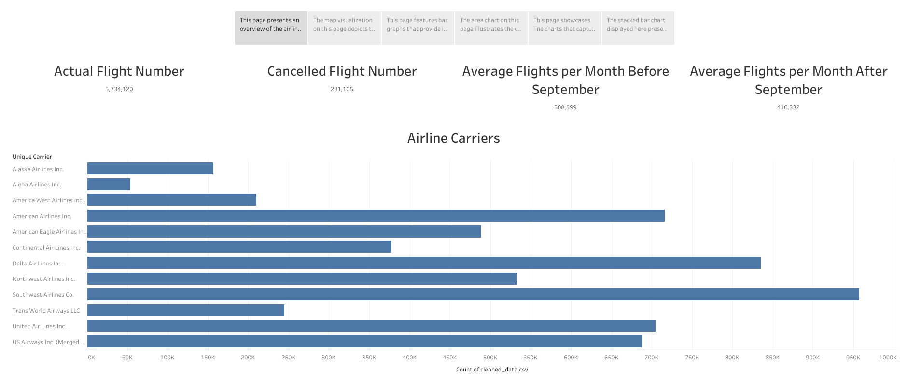

# Program Name: `2001 Aviation Landscape` *Using **`Tableau and Python`***

## Description:

The "2001 Aviation Landscape" project utilizes Tableau and Python to analyze and visualize aviation data from the year 2001. The project aims to uncover insights and trends related to flight patterns, cancellations, and the significant impact of the 9/11 tragedy on air travel. By leveraging Tableau's visualizations and Python's data processing capabilities, this project provides a comprehensive exploration of the aviation landscape during that period.

## Data Collection

I collected the data using the following steps:

1. Download the flight data from kaggle: [Flight Records](https://www.kaggle.com/datasets/bulter22/airline-data?resource=download&select=airline.csv.shuffle).
2. Download the carrier data from kaggle: [Carrier Info](https://www.kaggle.com/datasets/bulter22/airline-data?resource=download&select=carriers.csv).
3. Download the airport code data from github: [Airport Codes](https://github.com/lxndrblz/Airports/blob/main/citycodes.csv).
4. Placed all files into the Data folder.

## Data Processing

The data processing pipeline consists of several steps:

1. **Shuffle to CSV Conversion** (`shuffle_to_csv.py`): The script converts .shuffle files to CSV format. It iterates over the files in a specified directory, identifies .shuffle files, and converts them to CSV using pandas. Each file is read in chunks, which are then appended to a new CSV file. The script also removes the original .shuffle files. It provides a convenient way to convert shuffled data into a more accessible and widely used format for further analysis or processing.
2. **Data Cleaning** (`data_cleaning.py`): is designed to clean and transform airline data for further analysis. The script leverages the pandas library to read the data in chunks, process each chunk, and save the cleaned data to a new CSV file. The resulting cleaned dataset is ready for analysis and visualization. It utilizes two additional datasets: the carrier codes CSV and the airport codes CSV. The carrier codes CSV provides information about the unique carrier codes used in the airline data. This dataset allows for the replacement of the original UniqueCarrier column with more descriptive carrier names, enhancing the interpretability of the data. The airport codes CSV contains comprehensive details about various airports, including their geographical location, state, and airport codes. By merging this dataset with the airline data, the script enriches the dataset with additional information such as airport names, latitude, longitude, and state. The script performs the following steps on the data:

* Filter the data to include only flights from the year 2001.
* Rename specific columns to ensure consistency and clarity.
* Filter out non-US flights by comparing airport codes.
* Combine year, month, and day columns into a single date column.
* Merge with airport codes dataset to add origin and destination information.
* Merge with carrier codes dataset to replace the UniqueCarrier column.
* Convert time columns from HHMM format to datetime format.
* Remove unnecessary columns.
* Reorder the columns to improve readability.

## Data Analysis and Reporting

The Tableau Story, titled "Flight Journey: Unveiling the 2001 Aviation Landscape in the US," provides a comprehensive analysis of the aviation data for the year 2001. It uncovers various insights and trends related to flight patterns, cancellations, and the significant impact of the 9/11 tragedy on air travel. The Tableau Story can be accessed [here](https://public.tableau.com/shared/FXGM3DP2Z?:display_count=n&:origin=viz_share_link).

The Tableau Story consists of six pages, each focusing on different aspects of the data:

1. **Overview of 2001 Airline Data** : This page presents an overview of the airline data for the year 2001. It showcases the total number of actual flights, providing an understanding of the volume of air traffic during that period. The visualization also highlights the count of cancelled flights, shedding light on the impact of various factors on flight cancellations. Additionally, it displays the average flights per month, allowing for the exploration of seasonal variations and trends in air travel.
2. **Geographic Distribution of US Airports** : This page utilizes map visualizations to depict the geographic distribution of US airports, including Puerto Rico and the Virgin Islands. By using average longitude and latitude coordinates, it visualizes the concentration of airports across different regions. The color coding represents the states where these airports are located. Another map visualization adds bubble sizes to represent the count of flights originating from each airport, providing insights into busier airports and their relative importance in terms of air traffic.
3. **Timing of Flights** : This page features bar graphs that provide insights into the timing of flights. One graph shows the count of flights for each hour of arrival time, highlighting peak and off-peak hours. Another graph focuses on the count of flights for each hour of departure time, enabling the identification of the busiest hours of air travel.
4. **Monthly Flight Counts** : The area chart on this page illustrates the count of flights for each month, enabling the identification of overall trends and patterns in air travel throughout the year. Another area chart adds color coding to represent cancelled flights, allowing the analysis of the impact of cancellations on the monthly count and identifying potential correlations between cancellations and specific months.
5. **Trends of Flight Counts** : This page showcases line charts that capture the trend of flight counts for each month. One chart focuses on cancelled flights, providing insights into the impact of cancellations on overall air traffic patterns. The other chart examines actual flights that were not cancelled, offering a deeper understanding of air travel demand and any variations compared to the cancelled flights.
6. **Weekly Flight Counts and 9/11 Tragedy** : The stacked bar chart presented on this page depicts the count of flights for each day of the week. The color coding distinguishes cancelled flights, enabling the identification of significant variations and patterns in flight counts by day. It offers insights into weekly trends and provides an opportunity to observe the impact of cancellations on specific days. Additionally, this page discusses the profound effect of the 9/11 tragedy on air travel, highlighting the significant increase in flight cancellations.

Through these visualizations and analyses, the Tableau Story provides a comprehensive exploration of the 2001 aviation landscape in the US, covering various aspects of flight data, cancellations, airport distribution, timing, and monthly trends. It offers valuable insights and facilitates a deeper understanding of the dynamics of air travel during that period.

Please refer to the `tableau_story.md` for a more detailed explanation of the Tableau story.

## Visual Analysis: First Page of Story

Here is a visual representation of the first page in the Tableau story.

## How to Run the Project

To run the project, follow these steps:

1. Download the flight data from [Kaggle](https://www.kaggle.com/datasets/bulter22/airline-data?resource=download&select=airline.csv.shuffle).
2. Place the downloaded shuffle file into the `Data` folder.
3. Ensure that the required dependencies, such as pandas, are installed.
4. Before running any scripts, make sure to edit the `config.py` file according to your needs. Adjust any necessary configurations, such as file paths or other variables, based on your system setup.
5. Run the following scripts in the given order:
   * `shuffle_to_csv.py`: This script converts the shuffle file to CSV format.
   * `data_cleaning.py`: This script cleans data into a single csv file.
6. Import the cleaned and combined data into Power BI.
7. Open a new Tableau book import the data, and explore visualizations and analysis.

Note: Make sure to adjust any file paths or configurations in the `config.py` file and other scripts as needed to match your system setup and file locations.

## Additional Resources

* `config.py`: Contains global variables used in various files. Edit this file to configure the project according to your system setup.
* `Data Dictionary.xlsx`: Provides old and new column names and descriptions for the flight data.
